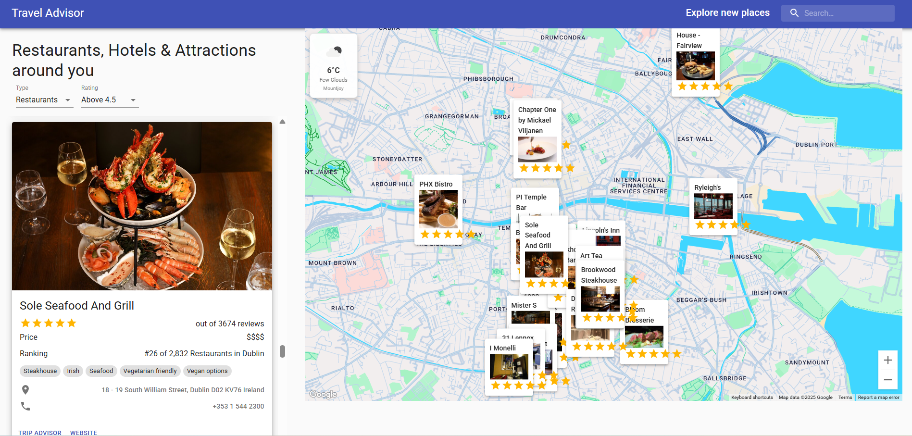

# Map-Based Travel Recommendation System

A React-based travel assistant that helps users discover restaurants, hotels, and attractions with real-time weather and an interactive Google Map interface.  

---

## Live Demo
[Map-Based Travel Recommendation System](https://travel-rco-sys.netlify.app/)  
GitHub: [https://github.com/SeanXC/travel-advisor-app](https://github.com/SeanXC/travel-advisor-app)

---

## Preview


---

## Features
- Developed a React SPA travel assistant integrating Google Maps and Google Places APIs for real-time restaurant, attraction, and hotel search  
- Implemented a responsive-design React frontend using Material-UI and React Hooks for state management  
- Integrated OpenWeatherMap API and RapidAPI (Travel Advisor) via Axios to provide dynamic location and weather data, with bidirectional map–list interactions and custom map styling  
- Enhanced code quality with ESLint, achieved 90%+ test coverage using Jest and React Test Utilities, and engineered a CI/CD pipeline with GitHub and Netlify for automated deployments  

---

## Tech Stack
- Frontend: React (Hooks, Material-UI)  
- APIs: Google Maps API, Google Places API, RapidAPI (Travel Advisor), OpenWeatherMap  
- Testing: Jest, React Test Utilities, ESLint  
- Deployment: GitHub + Netlify (CI/CD)  

---

## Highlights
- Hands-on experience with multiple third-party API integrations  
- Building responsive and interactive UIs with React and Material-UI  
- Applied state management and asynchronous API handling with Axios  
- Set up CI/CD deployment pipeline on Netlify for automatic builds  

---

## Project Structure
.
├── .github/                # GitHub Actions workflows  
├── coverage/               # Test coverage reports  
├── node_modules/           # Project dependencies  
├── public/                 # Static assets  
├── src/  
│   ├── __tests__/          # Unit and integration tests  
│   ├── api/                # API requests (Axios)  
│   ├── components/         # Reusable React components  
│   │   ├── __tests__/      # Component-level tests  
│   │   ├── Header/  
│   │   ├── List/  
│   │   ├── Map/  
│   │   └── PlaceDetails/  
│   ├── App.js              # Main app entry  
│   ├── index.js            # React DOM render  
│   └── setupTests.js       # Test setup configuration  
├── .env                    # Environment variables (API keys)  
├── .eslintrc.json          # ESLint configuration  
├── .gitignore              # Git ignore rules  
├── LICENSE                 # License file  
├── netlify.toml            # Netlify deployment configuration  
├── package.json            # Project dependencies  
├── package-lock.json       # Dependency lock file  
├── README.md               # Project documentation  
└── README.old.md           # Initial auto-generated README  

---

## Getting Started (Local Setup)
```bash
# 1. Clone repo
git clone https://github.com/SeanXC/travel-advisor-app.git
cd travel-advisor-app

# 2. Install dependencies
npm install

# 3. Add your API keys
#   - Google Maps API Key
#   - RapidAPI (Travel Advisor)
#   - OpenWeather API
# Create a .env file and configure:
#   REACT_APP_GOOGLE_MAPS_API_KEY=xxxx
#   REACT_APP_RAPIDAPI_KEY=xxxx
#   REACT_APP_OPENWEATHER_KEY=xxxx

# 4. Run development server
npm start


```


---

## Contributions
This was a personal project built to deepen skills in:  
- React frontend development with responsive design  
- API integration (Google Maps, Places, RapidAPI, OpenWeather) and state management with Axios  
- Code quality and testing with ESLint, Jest, and React Test Utilities  
- Deployment with modern CI/CD tools (GitHub Actions + Netlify)  

---

## License
MIT License – feel free to use and modify for learning purposes.

---

## Acknowledgments
I would like to thank [JavaScript Mastery](https://www.youtube.com/@javascriptmastery) for their tutorials and inspiration, which guided me in building this project.

